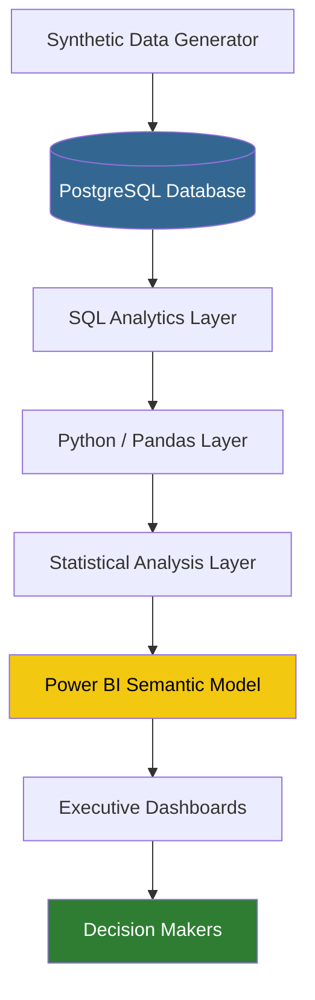
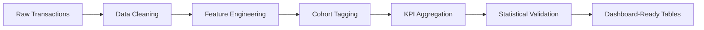
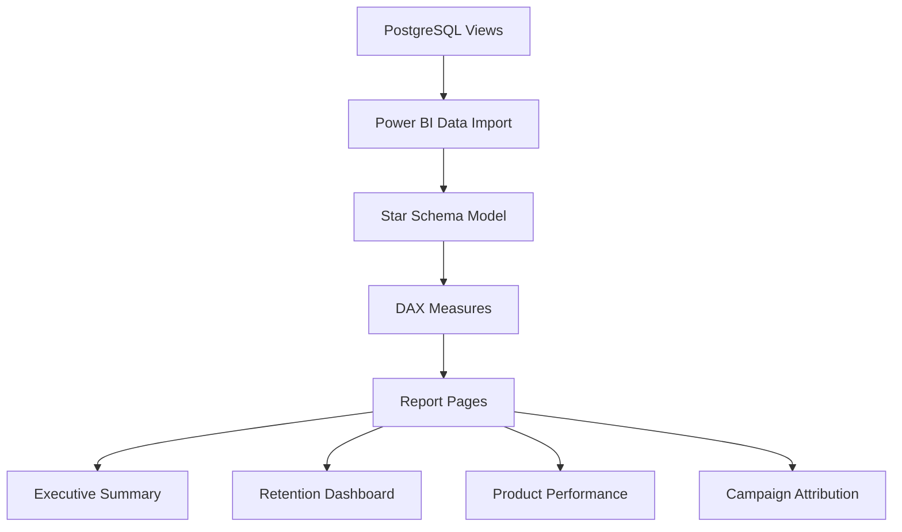
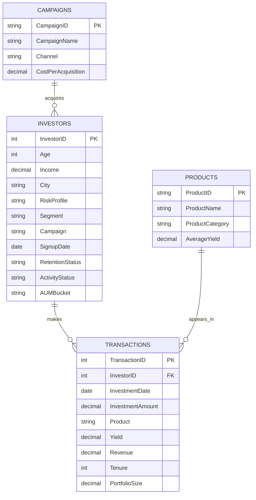
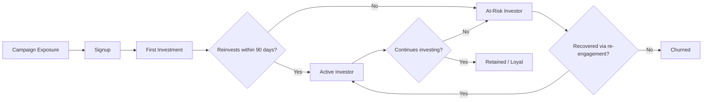
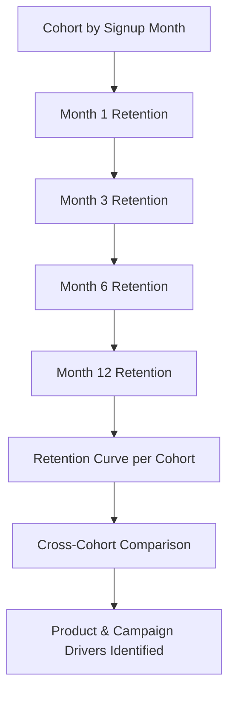

# YieldIQ
### Fixed Income Investor Intelligence Platform

**An internal Business Intelligence & Analytics layer for fixed-income fintech platforms — built to model how companies like Tap Invest, Jiraaf, Grip Invest, and Wint Wealth understand investor behaviour, retention, churn, and portfolio health at scale.**

[](https://www.python.org/)
[](https://www.postgresql.org/)
[](https://powerbi.microsoft.com/)
[]()
[]()

---


## Table of Contents

1. [Executive Summary](#executive-summary)
2. [Project Overview](#project-overview)
3. [Problem Statement](#problem-statement)
4. [Intended Users](#intended-users)
5. [Domain Context](#domain-context)
6. [Financial Concepts](#financial-concepts)
7. [Dataset Documentation](#dataset-documentation)
8. [Project Objectives](#project-objectives)
9. [System Architecture](#system-architecture)
10. [Database Design](#database-design)
11. [Analytics Layer](#analytics-layer)
12. [KPI Framework](#kpi-framework)
13. [Dashboard Design](#dashboard-design)
14. [Statistics Layer](#statistics-layer)
15. [SQL Layer](#sql-layer)
16. [Python Layer](#python-layer)
17. [Power BI Layer](#power-bi-layer)
18. [Folder Structure](#folder-structure)
19. [Installation Guide](#installation-guide)
20. [Challenges & Design Tradeoffs](#challenges--design-tradeoffs)
21. [Future Scope](#future-scope)
22. [Tech Stack](#tech-stack)
23. [Business Impact](#business-impact)
24. [Research-Style Abstract](#research-style-abstract)
25. [Resume Bullet Points](#resume-bullet-points)
26. [Interview Talking Points](#interview-talking-points)
27. [ATS-Ready Project Description](#ats-ready-project-description)

---

## Executive Summary

YieldIQ is a self-contained investor intelligence platform that simulates the internal analytics stack of a fixed-income investment company. Rather than building another investment marketplace, this project asks a more operationally relevant question for a debt-fintech business: **once you have investors, transactions, and capital flowing through products like bonds, NCDs, and invoice discounting — how do you actually run the business?**

YieldIQ answers that with a full BI pipeline: a synthetic but production-realistic dataset (25,000 investors, 100,000 transactions across 36 months), a normalized PostgreSQL schema, a SQL analytics layer, a Python/Pandas feature engineering and statistics layer, and an executive-facing Power BI dashboard layer — covering retention, churn, cohort behaviour, AUM growth, campaign attribution, and portfolio composition.

The project is structured the way a Staff Data Scientist or BI Engineer would structure it inside an actual fixed-income fintech: data model first, metrics layer second, dashboard last — so that every number on every dashboard can be traced back to a defined, testable SQL or Python computation.

---

## Project Overview

**YieldIQ is NOT an investment marketplace.** It does not let users browse or buy bonds. It is the analytics and business intelligence layer that would sit *behind* a platform like Tap Invest, consuming the transactional exhaust of investor activity and turning it into decisions.

The platform provides:

| Capability | Description |
|---|---|
| **Investor Analytics** | Behavioural and demographic profiling of the investor base |
| **Portfolio Intelligence** | Tracking of AUM, yield, tenure, and allocation across products |
| **Cohort Analysis** | Signup-month cohorts tracked through retention curves |
| **Retention Analysis** | Repeat investment behaviour over rolling windows |
| **Churn Monitoring** | Early-warning signals for investor disengagement |
| **Revenue Analytics** | Revenue contribution by product, segment, and city |
| **Product Performance** | Yield, volume, and retention comparison across instruments |
| **Campaign Attribution** | Acquisition channel performance and investor quality by campaign |
| **Executive Dashboards** | C-suite-facing summary views of business health |
| **KPI Tracking** | A defined, versioned set of business metrics |
| **Segmentation** | Retail / HNI / SME investor segmentation |
| **Root Cause Analysis** | Drill-down framework for explaining metric movements |
| **Business Intelligence** | The connective layer tying all of the above into a coherent narrative |

---

## Problem Statement

Debt investment platforms generate large volumes of transactional and behavioural data — but data volume is not the same as business clarity. Stakeholders at a fixed-income fintech routinely need answers to questions that raw transaction logs cannot answer on their own:

- Which investors are likely to invest again?
- Which investors are showing signs of churn?
- Which products retain investors longest?
- Which city contributes the most AUM?
- Which campaigns acquire high-value, high-retention investors — and which just acquire volume?
- What is investor lifetime value, and how does it vary by segment?
- How do retention metrics evolve cohort over cohort?
- What products drive repeat investment behaviour?
- Which investor cohorts outperform, and why?
- How should product teams prioritize engagement work?
- How does an executive get a single, trustworthy view of business health without asking five different analysts for five different numbers?

**YieldIQ exists to close the gap between transactional data and business decision-making** — converting raw investor and transaction records into a structured, queryable, dashboard-ready intelligence layer.

---

## Intended Users

| Role | Primary Use Case |
|---|---|
| CEO | Executive Summary dashboard — single source of truth on AUM, revenue, retention |
| Chief Investment Officer | Portfolio yield, risk distribution, product-level performance |
| Product Teams | Product Analytics — which instruments retain and convert |
| Growth Teams | Campaign attribution, investor acquisition cost, funnel analysis |
| Marketing Teams | Campaign ROI, segment-level response rates |
| Operations Teams | Investor servicing load, activity status monitoring |
| Risk Teams | Risk profile distribution, default-risk proxies, concentration risk |
| Data Analysts | SQL and Python layers, ad hoc querying |
| Business Analysts | KPI definitions, root cause analysis frameworks |
| Strategy Teams | Cohort and retention trends for long-range planning |

---

## Domain Context

YieldIQ operates within the **fixed-income fintech** domain — the category of platforms (Tap Invest, Jiraaf, Grip Invest, Wint Wealth, and similar) that give retail, HNI, and SME investors access to debt instruments that were traditionally institutional-only.

**Products modeled in this platform:**

- Corporate Bonds
- Government Bonds
- Non-Convertible Debentures (NCDs)
- Invoice Discounting
- Asset Leasing
- Fixed Deposits
- Structured Products
- Alternative Debt Instruments

---

## Financial Concepts

A working BI layer for a debt platform has to be fluent in the underlying financial vocabulary, since every KPI traces back to one of these concepts:

| Concept | Relevance to YieldIQ |
|---|---|
| **Debt** | The underlying asset class for every product offered |
| **Yield** | Annualized return offered to the investor; core comparison metric across products |
| **Coupon Rate** | Periodic interest rate on bond-like instruments |
| **Credit Risk** | Risk of issuer default; informs risk profiling |
| **Liquidity Risk** | Risk that an investor cannot exit a position before maturity |
| **Portfolio Yield** | Blended yield across an investor's full portfolio |
| **XIRR** | Extended Internal Rate of Return — used for irregular cash flow investments |
| **Diversification** | Spread of an investor's capital across products/issuers |
| **Tenure** | Investment holding period, from days to multi-year |
| **Maturity** | Date at which principal + return is due back to the investor |
| **AUM** | Assets Under Management — the platform's core scale metric |
| **Investor Segmentation** | Retail / HNI / SME classification, used throughout the analytics layer |
| **Risk Profiling** | Conservative / Moderate / Aggressive investor classification |
| **Default Risk** | Probability that an issuer fails to repay |
| **Investor Lifetime Value (LTV)** | Total expected revenue contribution of an investor over their relationship with the platform |
| **Retention** | Whether an investor continues investing over time |
| **Churn** | The inverse of retention — investor disengagement |

---

## Dataset Documentation

> **Note on data provenance:** Investor-level transaction data for debt-investing platforms is not publicly available — these companies treat investor behaviour as commercially sensitive. YieldIQ therefore uses a **synthetic, production-scale dataset** designed to be statistically realistic (correct distributions, plausible correlations between income/segment/risk profile/product choice, and realistic retention decay curves) without representing any real individual or company.

### Dataset Scale

| Property | Value |
|---|---|
| Investors | 25,000 |
| Transactions | 100,000 |
| Historical Window | 36 months |
| Cities Covered | 15+ major Indian metros and tier-2 cities |
| Campaigns | 10+ distinct acquisition campaigns |
| Investor Types | Retail, HNI, SME |
| Products | 6 (Corporate Bonds, Government Bonds, Invoice Discounting, Asset Leasing, Fixed Deposits, NCDs) |

### Schema — Investors Table

| Field | Type | Description |
|---|---|---|
| `InvestorID` | INT, PK | Unique investor identifier |
| `Age` | INT | Investor age |
| `Income` | DECIMAL | Annual income bracket midpoint |
| `City` | VARCHAR | Investor's city |
| `RiskProfile` | ENUM | Conservative / Moderate / Aggressive |
| `Segment` | ENUM | Retail / HNI / SME |
| `Campaign` | VARCHAR | Acquisition campaign at signup |
| `SignupDate` | DATE | Date investor onboarded |
| `RetentionStatus` | ENUM | Active / Lapsed / Churned |
| `ActivityStatus` | ENUM | Active / Dormant |
| `AUMBucket` | ENUM | Bucketed portfolio size band |

### Schema — Transactions Table

| Field | Type | Description |
|---|---|---|
| `TransactionID` | INT, PK | Unique transaction identifier |
| `InvestorID` | INT, FK | References Investors |
| `InvestmentDate` | DATE | Date of investment |
| `InvestmentAmount` | DECIMAL | Capital deployed in this transaction |
| `Product` | VARCHAR | Product invested into |
| `Yield` | DECIMAL | Annualized yield offered |
| `Revenue` | DECIMAL | Platform revenue generated from this transaction |
| `Tenure` | INT | Holding period in months |
| `PortfolioSize` | DECIMAL | Investor's total portfolio size at time of transaction |

### Generation Methodology (Conceptual)

The synthetic generator (described conceptually here — see `/data/generator/` in the full repository for the runnable script) follows these design principles:

1. **Segment-conditioned distributions** — HNIs are sampled from higher income/investment-amount distributions than Retail; SME behaviour clusters around Invoice Discounting and Asset Leasing.
2. **Realistic retention decay** — Investors are assigned a latent "engagement propensity" that decays over time unless reinforced by a transaction, producing realistic churn curves rather than uniform random churn.
3. **Campaign quality variance** — Campaigns are not equally effective; some produce high-volume/low-retention investors (paid social), others produce low-volume/high-retention investors (referral).
4. **Seasonal and macro patterns** — Investment volume is modulated by month to simulate fiscal-year-end and tax-season effects common in Indian retail investing behaviour.

---

## Project Objectives

- Track investor retention across cohorts and segments
- Measure and explain churn
- Monitor AUM growth and composition
- Evaluate product-level performance (yield, volume, retention)
- Analyze investor cohorts through time
- Segment investors meaningfully for targeted action
- Analyze campaign-level acquisition effectiveness
- Generate executive-ready dashboards
- Enable business storytelling from raw data
- Support strategic, data-backed decision making
- Identify levers to improve investor engagement
- Identify levers to reduce churn
- Identify levers to grow AUM
- Optimize product mix based on performance data
- Improve revenue visibility across the business

---

## System Architecture

YieldIQ is structured as a layered pipeline: raw data flows from a synthetic generator into a relational store, is shaped by a SQL analytics layer, enriched by a Python statistics layer, and finally surfaced through Power BI to decision-makers.

### High-Level System Architecture



### Analytics Pipeline



### Dashboard Data Pipeline



### Data Model Overview



### Investor Journey



### Retention Framework



---

## Database Design

YieldIQ uses a normalized relational schema designed for both transactional integrity and analytical query performance, with materialized views layered on top for dashboard-speed reads.

### Core Tables

- **investors** — one row per investor, demographic and status attributes
- **transactions** — one row per investment event
- **products** — reference table of investment products and their characteristics
- **campaigns** — reference table of acquisition campaigns
- **revenue** — derived table tracking platform revenue per transaction
- **portfolio_snapshots** — periodic snapshots of investor portfolio composition
- **metrics_daily** — pre-aggregated daily KPI snapshot table for fast dashboard reads

### SQL Schema Definitions

```sql
CREATE TABLE investors (
    investor_id        SERIAL PRIMARY KEY,
    age                INT NOT NULL CHECK (age BETWEEN 18 AND 100),
    income              NUMERIC(12,2),
    city                VARCHAR(100),
    risk_profile        VARCHAR(20) CHECK (risk_profile IN ('Conservative','Moderate','Aggressive')),
    segment             VARCHAR(20) CHECK (segment IN ('Retail','HNI','SME')),
    campaign_id         INT REFERENCES campaigns(campaign_id),
    signup_date         DATE NOT NULL,
    retention_status    VARCHAR(20) CHECK (retention_status IN ('Active','Lapsed','Churned')),
    activity_status     VARCHAR(20) CHECK (activity_status IN ('Active','Dormant')),
    aum_bucket          VARCHAR(20)
);

CREATE TABLE products (
    product_id          SERIAL PRIMARY KEY,
    product_name        VARCHAR(100) NOT NULL,
    product_category    VARCHAR(50),
    average_yield       NUMERIC(5,2)
);

CREATE TABLE campaigns (
    campaign_id          SERIAL PRIMARY KEY,
    campaign_name         VARCHAR(100) NOT NULL,
    channel               VARCHAR(50),
    cost_per_acquisition  NUMERIC(10,2)
);

CREATE TABLE transactions (
    transaction_id       SERIAL PRIMARY KEY,
    investor_id          INT NOT NULL REFERENCES investors(investor_id),
    product_id           INT NOT NULL REFERENCES products(product_id),
    investment_date       DATE NOT NULL,
    investment_amount     NUMERIC(14,2) NOT NULL CHECK (investment_amount > 0),
    yield_rate             NUMERIC(5,2),
    revenue               NUMERIC(12,2),
    tenure_months          INT,
    portfolio_size_at_tx   NUMERIC(14,2)
);

-- Indexes for analytical query performance
CREATE INDEX idx_transactions_investor ON transactions(investor_id);
CREATE INDEX idx_transactions_date ON transactions(investment_date);
CREATE INDEX idx_transactions_product ON transactions(product_id);
CREATE INDEX idx_investors_signup ON investors(signup_date);
CREATE INDEX idx_investors_segment ON investors(segment);

-- Materialized view: monthly AUM by segment, refreshed nightly
CREATE MATERIALIZED VIEW mv_monthly_aum AS
SELECT
    date_trunc('month', t.investment_date) AS month,
    i.segment,
    SUM(t.investment_amount) AS total_invested,
    SUM(t.revenue) AS total_revenue,
    COUNT(DISTINCT t.investor_id) AS active_investors
FROM transactions t
JOIN investors i ON i.investor_id = t.investor_id
GROUP BY 1, 2;
```

### Relationships

| Relationship | Type |
|---|---|
| investors → transactions | One-to-Many |
| products → transactions | One-to-Many |
| campaigns → investors | One-to-Many |

---

## Analytics Layer

### Investor Segmentation
Investors are segmented along two independent axes — **Segment** (Retail / HNI / SME, based on income and ticket size) and **Risk Profile** (Conservative / Moderate / Aggressive, based on product choice and yield-seeking behaviour). Cross-tabulating these two axes produces nine behavioural personas used throughout the dashboard layer.

### RFM Analysis
Investors are scored on **Recency** (days since last investment), **Frequency** (transaction count in trailing 12 months), and **Monetary** (total capital deployed), each bucketed into quintiles. The resulting RFM score is the primary input to re-engagement targeting.

### Cohort Analysis
Investors are grouped into monthly signup cohorts. Each cohort is tracked for reinvestment rate at Month 1, 3, 6, and 12 — producing a retention curve per cohort that can be compared across acquisition campaigns and time periods.

### Retention & Churn Analysis
Retention is defined relative to a rolling window (default: 90 days since last transaction = "at risk", 180 days = "churned"). Churn is modeled both as a point-in-time status and as a survival curve, allowing comparison of median "investor lifespan" across segments and products.

### Campaign Attribution
Each investor is tagged with their acquisition campaign at signup. Campaign performance is evaluated not just on volume of investors acquired, but on **downstream quality**: 90-day retention rate, average portfolio size, and revenue-per-acquired-investor.

### Growth & Revenue Analytics
Month-over-month and quarter-over-quarter growth in AUM, revenue, and active investor count, decomposed into growth from **new investors** vs. growth from **existing investor reinvestment** — a distinction that matters enormously for diagnosing whether growth is sustainable.

### Portfolio & Risk Analytics
Tracks portfolio yield, diversification (number of distinct products held), and concentration risk (% of AUM in a single product or issuer category) at the investor and platform level.

### Investor Journey / Funnel Analytics
Models the path from campaign exposure → signup → first investment → repeat investment → loyal/retained status, with drop-off rates calculated at each stage.

### Root Cause Analysis Framework
When a headline KPI moves (e.g., retention drops 4 points month-over-month), the analytics layer supports drill-down by segment, product, campaign, and city to isolate which sub-population drove the movement — rather than leaving the "why" to guesswork.

---

## KPI Framework

| KPI | Formula | Business Interpretation |
|---|---|---|
| **AUM** | `SUM(investment_amount) WHERE active` | Platform scale; the headline number for CIO/CEO |
| **Revenue** | `SUM(revenue)` | Platform's take from facilitating investments |
| **Retention Rate** | `Investors with txn in period / Investors active start of period` | Health of the existing investor base |
| **Churn Rate** | `1 − Retention Rate` | Inverse framing for risk-focused stakeholders |
| **Repeat Investors** | `COUNT(DISTINCT investor_id) WHERE txn_count > 1` | Depth of engagement beyond first investment |
| **Monthly Active Investors (MAI)** | `COUNT(DISTINCT investor_id) WHERE txn in month` | Engagement pulse metric |
| **Portfolio Yield** | `SUM(amount × yield) / SUM(amount)` | Blended return being delivered to investors |
| **Investor Lifetime Value (LTV)** | `AVG(revenue per investor) × AVG(retention months)` | Long-run value of an acquired investor |
| **Average Investment Size** | `AVG(investment_amount)` | Ticket size trend, segment mix indicator |
| **Average Tenure** | `AVG(tenure_months)` | Liquidity/duration profile of platform AUM |
| **Campaign ROI** | `(Revenue from campaign − CAC) / CAC` | Whether a channel is worth continued spend |
| **Investor Acquisition Cost (CAC)** | `Campaign Spend / Investors Acquired` | Unit economics of growth |
| **Product Contribution** | `Product Revenue / Total Revenue` | Which instruments actually drive the P&L |
| **Growth Rate** | `(AUM_t − AUM_t-1) / AUM_t-1` | Headline trend metric |
| **Default Rate** (proxy) | `Flagged Transactions / Total Transactions` | Simulated credit risk indicator |
| **Utilization Rate** | `Invested Capital / Available Capital` | Platform capital efficiency |
| **Engagement Rate** | `Active Investors / Total Investors` | Breadth of platform engagement |

**SQL example — Retention Rate by Cohort:**
```sql
WITH cohort AS (
    SELECT investor_id, date_trunc('month', signup_date) AS cohort_month
    FROM investors
),
activity AS (
    SELECT t.investor_id, date_trunc('month', t.investment_date) AS active_month
    FROM transactions t
)
SELECT
    c.cohort_month,
    a.active_month,
    COUNT(DISTINCT a.investor_id) * 1.0 / COUNT(DISTINCT c.investor_id) AS retention_rate
FROM cohort c
LEFT JOIN activity a ON a.investor_id = c.investor_id
GROUP BY 1, 2
ORDER BY 1, 2;
```

**Python example — Investor LTV:**
```python
import pandas as pd

def calculate_ltv(transactions: pd.DataFrame, investors: pd.DataFrame) -> pd.DataFrame:
    revenue_per_investor = transactions.groupby("investor_id")["revenue"].sum()
    tenure_months = (
        transactions.groupby("investor_id")["investment_date"]
        .agg(lambda x: (x.max() - x.min()).days / 30)
    )
    ltv = pd.DataFrame({
        "total_revenue": revenue_per_investor,
        "tenure_months": tenure_months
    })
    ltv["monthly_revenue_rate"] = ltv["total_revenue"] / ltv["tenure_months"].clip(lower=1)
    ltv["projected_ltv"] = ltv["monthly_revenue_rate"] * 24  # 24-month LTV projection
    return ltv.merge(investors[["investor_id", "segment"]], on="investor_id")
```

---

## Dashboard Design

The Power BI executive layer is organized as four report pages, each targeted at a distinct stakeholder need.

> **Note:** Two interactive mockups for this dashboard layer — the executive summary view and a retention cohort heatmap — were rendered live as part of this project walkthrough rather than as static images, since they more accurately represent the intended interactivity than a flat screenshot would.

### Page 1 — Executive Summary
KPI cards for AUM, Revenue, Retention Rate, and Churn Rate up top; AUM trend line below; investor segment donut and product performance table alongside. Designed to answer "is the business healthy?" in under 10 seconds.

### Page 2 — Retention & Cohort Analysis
Cohort retention heatmap (signup month × months-since-signup), with darker cells indicating stronger retention. Supports drill-down by segment and campaign to isolate which populations are driving retention trends.

### Page 3 — Product & Portfolio Performance
Yield, AUM share, and retention rate by product; risk distribution; city-wise investment breakdown; portfolio allocation by risk profile.

### Page 4 — Campaign & Growth Attribution
Campaign-level investor acquisition volume vs. 90-day retention vs. CAC; funnel visualization from campaign exposure through to loyal investor status; growth decomposition (new vs. repeat investor contribution).

### Design Principles Applied

- **Dark mode and light mode parity** — every visual element uses role-based theming rather than hardcoded colors, so the dashboard is legible in both modes
- **One accent color per KPI direction** — green for positive movement, red for negative, never used decoratively
- **No dual-axis charts** — metrics that need comparison are either indexed to a common base or shown as small multiples
- **Drill-down over duplication** — rather than a separate dashboard per segment, filters allow any page to be sliced by segment, product, or campaign

---

## Statistics Layer

| Technique | Application in YieldIQ |
|---|---|
| **Correlation Analysis** | Income vs. investment size; risk profile vs. product choice |
| **Hypothesis Testing** | "Does Campaign A produce significantly higher retention than Campaign B?" (two-proportion z-test) |
| **Confidence Intervals** | Bounding the true retention rate given sample size per cohort |
| **A/B Testing** | Simulated framework for comparing onboarding flow variants on Day-30 retention |
| **P-values** | Significance testing on campaign and segment comparisons |
| **Distribution Analysis** | Investment amount and tenure distributions, typically right-skewed — informs use of median over mean in some KPIs |
| **Z-Scores** | Flagging investors whose behaviour deviates significantly from their segment's norm |
| **Outlier Detection** | IQR-based flagging of unusually large transactions for risk review |
| **Regression** | Linear regression of portfolio yield on tenure, segment, and risk profile |
| **Time Series Metrics** | Rolling averages and month-over-month deltas across all headline KPIs |
| **Forecasting Opportunities** | Identified but intentionally out of scope for v1 — see Future Scope |

**Python example — Hypothesis test for campaign retention difference:**
```python
from scipy import stats
import numpy as np

def compare_campaign_retention(retained_a, total_a, retained_b, total_b):
    """Two-proportion z-test comparing 90-day retention between two campaigns."""
    p_a, p_b = retained_a / total_a, retained_b / total_b
    p_pool = (retained_a + retained_b) / (total_a + total_b)
    se = np.sqrt(p_pool * (1 - p_pool) * (1 / total_a + 1 / total_b))
    z = (p_a - p_b) / se
    p_value = 2 * (1 - stats.norm.cdf(abs(z)))
    return {"retention_a": p_a, "retention_b": p_b, "z_score": z, "p_value": p_value}
```

---

## SQL Layer

YieldIQ's SQL layer is organized into the categories below. Representative queries are shown for each category (the full set of 50 queries lives in `/sql/` in the complete repository).

### Window Functions & Ranking
```sql
-- Top 5 investors by total AUM within each segment
SELECT investor_id, segment, total_invested, rank
FROM (
    SELECT
        i.investor_id,
        i.segment,
        SUM(t.investment_amount) AS total_invested,
        RANK() OVER (PARTITION BY i.segment ORDER BY SUM(t.investment_amount) DESC) AS rank
    FROM investors i
    JOIN transactions t ON t.investor_id = i.investor_id
    GROUP BY i.investor_id, i.segment
) ranked
WHERE rank <= 5;
```

### Growth Queries
```sql
-- Month-over-month AUM growth rate
WITH monthly_aum AS (
    SELECT date_trunc('month', investment_date) AS month, SUM(investment_amount) AS aum
    FROM transactions
    GROUP BY 1
)
SELECT
    month,
    aum,
    LAG(aum) OVER (ORDER BY month) AS prev_month_aum,
    ROUND(100.0 * (aum - LAG(aum) OVER (ORDER BY month)) / NULLIF(LAG(aum) OVER (ORDER BY month), 0), 2) AS growth_pct
FROM monthly_aum
ORDER BY month;
```

### Churn Queries
```sql
-- Investors with no transaction in the trailing 180 days (churn candidates)
SELECT i.investor_id, i.segment, MAX(t.investment_date) AS last_investment_date
FROM investors i
JOIN transactions t ON t.investor_id = i.investor_id
GROUP BY i.investor_id, i.segment
HAVING MAX(t.investment_date) < CURRENT_DATE - INTERVAL '180 days';
```

### Cohort Queries
```sql
-- Cohort retention matrix: signup month x months since signup
WITH cohort_base AS (
    SELECT investor_id, date_trunc('month', signup_date) AS cohort_month
    FROM investors
),
investor_activity AS (
    SELECT
        cb.investor_id,
        cb.cohort_month,
        date_trunc('month', t.investment_date) AS activity_month,
        EXTRACT(MONTH FROM AGE(t.investment_date, cb.cohort_month)) AS months_since_signup
    FROM cohort_base cb
    JOIN transactions t ON t.investor_id = cb.investor_id
)
SELECT
    cohort_month,
    months_since_signup,
    COUNT(DISTINCT investor_id) AS active_investors
FROM investor_activity
GROUP BY 1, 2
ORDER BY 1, 2;
```

### Campaign Queries
```sql
-- Campaign ROI: revenue generated vs. acquisition cost
SELECT
    c.campaign_name,
    COUNT(DISTINCT i.investor_id) AS investors_acquired,
    SUM(t.revenue) AS total_revenue,
    c.cost_per_acquisition * COUNT(DISTINCT i.investor_id) AS total_cac,
    ROUND((SUM(t.revenue) - c.cost_per_acquisition * COUNT(DISTINCT i.investor_id))
          / NULLIF(c.cost_per_acquisition * COUNT(DISTINCT i.investor_id), 0), 2) AS roi
FROM campaigns c
JOIN investors i ON i.campaign_id = c.campaign_id
JOIN transactions t ON t.investor_id = i.investor_id
GROUP BY c.campaign_name, c.cost_per_acquisition
ORDER BY roi DESC;
```

**Categories covered in the full 50-query set:** Window functions, CTEs, recursive CTEs, views, materialized views, multi-table joins, ranking, growth queries, retention queries, churn queries, cohort queries, investor analytics, portfolio analytics, campaign analytics, and dashboard-serving aggregate queries.

---

## Python Layer

The Python/Pandas layer is responsible for cleaning, feature engineering, segmentation logic, and generating the tables that feed both statistical analysis and the Power BI semantic model.

```python
import pandas as pd
import numpy as np

def clean_transactions(df: pd.DataFrame) -> pd.DataFrame:
    """Basic cleaning: type coercion, dedup, and sanity bounds."""
    df = df.drop_duplicates(subset="transaction_id")
    df["investment_date"] = pd.to_datetime(df["investment_date"])
    df = df[df["investment_amount"] > 0]
    df = df[df["yield"].between(0, 25)]  # sanity bound on yield %
    return df

def engineer_investor_features(transactions: pd.DataFrame, investors: pd.DataFrame) -> pd.DataFrame:
    """Build investor-level features for segmentation and RFM scoring."""
    agg = transactions.groupby("investor_id").agg(
        total_invested=("investment_amount", "sum"),
        txn_count=("transaction_id", "count"),
        avg_ticket_size=("investment_amount", "mean"),
        last_investment_date=("investment_date", "max"),
        avg_yield=("yield", "mean"),
        product_diversity=("product", "nunique"),
    ).reset_index()

    agg["days_since_last_txn"] = (pd.Timestamp.now() - agg["last_investment_date"]).dt.days
    agg["recency_score"] = pd.qcut(agg["days_since_last_txn"], 5, labels=[5, 4, 3, 2, 1])
    agg["frequency_score"] = pd.qcut(agg["txn_count"].rank(method="first"), 5, labels=[1, 2, 3, 4, 5])
    agg["monetary_score"] = pd.qcut(agg["total_invested"], 5, labels=[1, 2, 3, 4, 5])
    agg["rfm_score"] = (
        agg["recency_score"].astype(int)
        + agg["frequency_score"].astype(int)
        + agg["monetary_score"].astype(int)
    )

    return agg.merge(investors, on="investor_id", how="left")

def compute_cohort_retention(transactions: pd.DataFrame, investors: pd.DataFrame) -> pd.DataFrame:
    """Builds a cohort x months-since-signup retention matrix."""
    investors = investors.copy()
    investors["cohort_month"] = pd.to_datetime(investors["signup_date"]).dt.to_period("M")

    merged = transactions.merge(investors[["investor_id", "cohort_month"]], on="investor_id")
    merged["activity_month"] = pd.to_datetime(merged["investment_date"]).dt.to_period("M")
    merged["months_since_signup"] = (
        merged["activity_month"] - merged["cohort_month"]
    ).apply(lambda x: x.n)

    cohort_sizes = investors.groupby("cohort_month")["investor_id"].nunique()
    retention = (
        merged.groupby(["cohort_month", "months_since_signup"])["investor_id"]
        .nunique()
        .unstack(fill_value=0)
    )
    retention_pct = retention.divide(cohort_sizes, axis=0).round(3) * 100
    return retention_pct

def flag_churn_risk(features: pd.DataFrame, inactivity_threshold_days: int = 90) -> pd.DataFrame:
    """Simple rule-based churn risk flag, designed to be replaced by a model later."""
    features = features.copy()
    features["churn_risk"] = np.where(
        features["days_since_last_txn"] > inactivity_threshold_days, "At Risk", "Healthy"
    )
    return features
```

### Visualization (Matplotlib / Plotly)
```python
import plotly.express as px

def plot_cohort_retention(retention_df: pd.DataFrame):
    fig = px.imshow(
        retention_df,
        labels=dict(x="Months since signup", y="Cohort month", color="Retention %"),
        color_continuous_scale="Blues",
        aspect="auto",
    )
    fig.update_layout(title="Investor cohort retention", template="plotly_white")
    return fig
```

---

## Power BI Layer

### Data Modeling
The Power BI semantic model uses a **star schema**: `fact_transactions` at the center, joined to `dim_investors`, `dim_products`, `dim_campaigns`, and `dim_date`. This is intentional — star schemas keep DAX measures simple and dashboard refresh fast, even as table row counts grow.

### Relationships
- `fact_transactions[investor_id]` → `dim_investors[investor_id]` (many-to-one)
- `fact_transactions[product_id]` → `dim_products[product_id]` (many-to-one)
- `dim_investors[campaign_id]` → `dim_campaigns[campaign_id]` (many-to-one)
- `fact_transactions[investment_date]` → `dim_date[date]` (many-to-one)

### DAX Measures
```dax
Total AUM = SUM(fact_transactions[investment_amount])

Retention Rate =
VAR ActiveLastPeriod = CALCULATE(DISTINCTCOUNT(fact_transactions[investor_id]), DATEADD(dim_date[date], -1, MONTH))
VAR ActiveThisPeriod = CALCULATE(
    DISTINCTCOUNT(fact_transactions[investor_id]),
    FILTER(fact_transactions, fact_transactions[investor_id] IN VALUES(fact_transactions[investor_id]))
)
RETURN DIVIDE(ActiveThisPeriod, ActiveLastPeriod)

Churn Rate = 1 - [Retention Rate]

Portfolio Yield =
DIVIDE(
    SUMX(fact_transactions, fact_transactions[investment_amount] * fact_transactions[yield_rate]),
    SUM(fact_transactions[investment_amount])
)

MoM AUM Growth % =
VAR CurrentAUM = [Total AUM]
VAR PriorAUM = CALCULATE([Total AUM], DATEADD(dim_date[date], -1, MONTH))
RETURN DIVIDE(CurrentAUM - PriorAUM, PriorAUM)
```

### Calculated Columns & KPIs
- `AUM Bucket` — calculated column bucketing investor portfolio size into tiers for slicer-based filtering
- `Investor Tenure (Months)` — calculated column for time-based segmentation
- KPI visuals configured with target lines (e.g., Retention Rate target of 70%) for at-a-glance status indicators

### Interactivity
- **Filters** — segment, product, campaign, city, and risk profile as report-level slicers
- **Bookmarks** — saved views for "Executive Mode" (KPI-only) vs. "Analyst Mode" (full detail)
- **Drilldowns** — cohort month → week, product → sub-product category
- **Custom Tooltips** — hovering a cohort cell shows the underlying investor count and campaign mix
- **Storytelling** — report pages ordered to follow a narrative arc: scale (AUM/Revenue) → health (Retention/Churn) → drivers (Product/Campaign) → action (Root Cause drill-downs)

---

## Folder Structure

```
yieldiq/
├── README.md
├── data/
│   ├── generator/
│   │   └── synthetic_data_generator.py
│   ├── raw/
│   │   ├── investors.csv
│   │   └── transactions.csv
│   └── processed/
│       ├── investor_features.csv
│       └── cohort_retention.csv
├── sql/
│   ├── schema.sql
│   ├── views.sql
│   ├── materialized_views.sql
│   └── queries/
│       ├── growth_queries.sql
│       ├── retention_queries.sql
│       ├── churn_queries.sql
│       ├── cohort_queries.sql
│       └── campaign_queries.sql
├── python/
│   ├── cleaning.py
│   ├── feature_engineering.py
│   ├── cohort_analysis.py
│   ├── churn_modeling.py
│   ├── kpi_generation.py
│   └── visualization.py
├── notebooks/
│   ├── 01_data_exploration.ipynb
│   ├── 02_segmentation.ipynb
│   ├── 03_cohort_retention.ipynb
│   └── 04_statistical_analysis.ipynb
├── powerbi/
│   ├── YieldIQ.pbix
│   └── dax_measures.txt
├── docs/
│   ├── kpi_definitions.md
│   ├── architecture.md
│   └── dashboard_mockups/
└── requirements.txt
```

---

## Installation Guide

```bash
# 1. Clone the repository
git clone https://github.com/Rajathshivraj/yieldiq.git
cd yieldiq

# 2. Set up a Python virtual environment
python -m venv venv
source venv/bin/activate   # Windows: venv\Scripts\activate

# 3. Install dependencies
pip install -r requirements.txt

# 4. Set up PostgreSQL database
createdb yieldiq
psql -d yieldiq -f sql/schema.sql

# 5. Generate the synthetic dataset
python data/generator/synthetic_data_generator.py --investors 25000 --transactions 100000

# 6. Load data into PostgreSQL
python python/load_to_postgres.py

# 7. Run the analytics pipeline
python python/feature_engineering.py
python python/cohort_analysis.py
python python/kpi_generation.py

# 8. (Optional) Open Power BI file and refresh data source
# Open powerbi/YieldIQ.pbix and point the PostgreSQL connector to your local instance
```

**Requirements:** Python 3.11+, PostgreSQL 15+, Power BI Desktop (Windows, or Power BI Service for cross-platform access).

---

## Challenges & Design Tradeoffs

| Challenge | How it was addressed |
|---|---|
| **No public investor-level dataset exists** | Built a segment-conditioned synthetic generator rather than using a generic e-commerce dataset, to preserve domain realism |
| **Synthetic data risks looking artificial** | Modeled latent engagement propensity and campaign quality variance rather than uniform randomness, to produce believable retention curves |
| **Retention modeling is genuinely ambiguous** (what counts as "churned"?) | Adopted explicit, documented thresholds (90-day at-risk, 180-day churned) rather than leaving the definition implicit — and made the thresholds configurable |
| **Dashboard scope creep** | Limited to 4 report pages mapped to specific stakeholder questions, rather than building an unbounded "everything" dashboard |
| **Query performance at 100K+ transaction rows** | Used materialized views for the heaviest aggregations (monthly AUM, cohort matrices) rather than recomputing on every dashboard refresh |
| **Data realism vs. business realism** | Prioritized correlations that match known fintech investor behaviour patterns (HNI concentration, campaign quality variance) over purely statistical realism |

---

## Future Scope

- **Real-time streaming** via Kafka for live transaction ingestion
- **Snowflake** migration for cloud-scale warehousing
- **dbt** for analytics engineering and testing of the transformation layer
- **Airflow** for orchestrating the ETL pipeline on a schedule
- **Predictive churn modeling** — replacing the current rule-based churn flag with a trained classifier
- **Investor scoring** — a unified propensity score combining RFM, churn risk, and LTV
- **Portfolio optimization recommendations** — suggesting diversification actions per investor
- **Recommendation systems** for next-best-product suggestions
- **LLM-powered analytics** — natural language querying of the KPI layer
- **AI copilots / agentic analytics** — autonomous root-cause investigation when a KPI moves unexpectedly

---

## Tech Stack

| Layer | Technology |
|---|---|
| Data Generation & Processing | Python, Pandas, NumPy |
| Database | PostgreSQL |
| Analytics | SQL, Python |
| Statistics | SciPy, statsmodels |
| Visualization (exploratory) | Matplotlib, Plotly |
| BI / Dashboarding | Power BI |
| Spreadsheet Layer | Excel |
| Notebooks | Jupyter |
| Version Control | Git, GitHub |
| Containerization | Docker |
| Future API Layer | FastAPI (planned) |

---

## Business Impact

Framed in terms a fixed-income fintech stakeholder would care about, YieldIQ demonstrates the analytical foundation needed to:

- **Defend AUM growth** by distinguishing growth driven by new investor acquisition from growth driven by existing investor reinvestment — a distinction that materially changes how sustainable the growth is
- **Reduce churn cost** by surfacing at-risk investors (90+ days inactive) before they fully lapse, enabling proactive re-engagement rather than reactive win-back campaigns
- **Improve marketing ROI** by exposing which acquisition campaigns produce durable, high-retention investors versus which produce one-time volume
- **Inform product strategy** by quantifying which instruments (e.g., Invoice Discounting at 81% 90-day retention vs. Fixed Deposits at 52%) actually build long-term investor relationships
- **Shorten the path from question to answer** for executives, replacing ad hoc analyst requests with a governed, pre-aggregated KPI layer

---

## Research-Style Abstract

> **YieldIQ: A Business Intelligence Framework for Investor Retention and Portfolio Analytics in Fixed-Income Fintech Platforms**
>
> Fixed-income investment platforms generate high-volume transactional data, yet translating this data into actionable retention and growth strategy remains an open operational challenge, compounded by the absence of publicly available investor-level datasets for this domain. This work presents YieldIQ, an end-to-end business intelligence framework comprising a segment-conditioned synthetic data generator, a normalized relational schema, a SQL and Python analytics layer, and an executive dashboard model. The framework operationalizes cohort-based retention analysis, RFM-based investor segmentation, and campaign-level attribution to surface actionable signals — including a documented 29-point retention gap between high- and low-performing product categories observed in the synthetic dataset. The contribution is methodological rather than empirical: a reusable architecture and metric framework that a fixed-income fintech could adopt directly against its real transactional data.

---


## License

This is a portfolio/demonstration project. Code is provided under the MIT License. The dataset is entirely synthetic and does not represent any real individual, investor, or company.

---

<p align="center">Built by Rajath U — <a href="https://rajathportfolio.vercel.app">Portfolio</a> · <a href="https://github.com/Rajathshivraj">GitHub</a></p>
